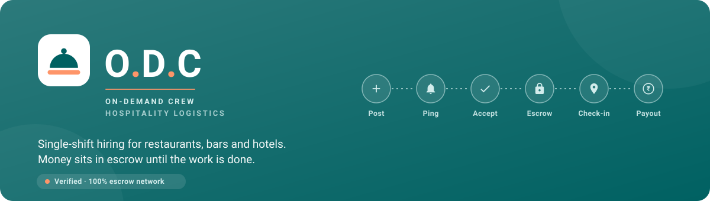

# O.D.C — On-Demand Crew

A multi-sided marketplace that connects restaurants, bars and hotels with freelance chefs and waiters for single-shift, on-demand hiring.

> Post a shift → nearby available crew get pinged → they accept or counter-offer → you lock one in and the money moves into escrow → they check in on site → you approve and the payout is released. Unclaimed requests auto-expire after 12 hours.


Bilingual (English / हिन्दी), light and dark themes, works one-handed on a phone browser.

**For people using the app, see [USER_GUIDE.md](USER_GUIDE.md).** This file is for running and developing it.

---

## Stack

**Frontend** — React 18 + Vite SPA, hash routing, Tailwind v4 design tokens generated from the Stitch design system, PWA-ready (manifest, service worker, web push).

**Backend** — Node.js + Express on **PostgreSQL** (`pg`), JWT access + rotating refresh tokens, bcrypt password hashing, TOTP 2FA for admins, OTP over simulated SMS, role-based access control enforced server-side on every route.

The REST API lives under `/api` (plus a separate private admin path), so native apps can plug in later without a rewrite.

## Requirements

- Node.js **≥ 22.5** (24 recommended — CI runs 24)
- PostgreSQL **14+** locally, *or* a hosted Postgres such as Supabase

## Run it locally

```bash
# 1. Database
createdb odc && createdb odc_test

# 2. API — port 4000
cd server
npm install
npm start          # or: npm run dev   (watch mode)

# 3. Web — port 5173, proxies /api to :4000
cd client
npm install
npm run dev
```

With no `server/.env` present the API connects to `postgresql://localhost:5432/odc`, creates its schema on boot, and seeds demo data.

For production, run `npm run build` in `client`; Express then serves the SPA and the API together on `:4000`.

In development, OTP codes are returned in the API response and printed to the log. Production expects a real SMS provider.

## Pointing at Supabase (or any hosted Postgres)

Create `server/.env` — it is gitignored, and the app loads it natively (no `dotenv` dependency):

```bash
cp server/.env.example server/.env
```

```bash
DATABASE_URL=postgresql://postgres.<project-ref>:<password>@aws-0-<region>.pooler.supabase.com:6543/postgres
DB_POOL_MAX=8
```

Things worth knowing:

- **Percent-encode special characters in the password** (`,` → `%2C`, `@` → `%40`).
- **Use a pooler endpoint, not the direct host.** `db.<ref>.supabase.co` publishes an IPv6 (`AAAA`) record only, so it is unreachable from an IPv4-only network. The transaction pooler on port `6543` works everywhere.
- **TLS is verified, not bypassed.** Supabase signs with its own CA, which is bundled at `server/certs/supabase-ca.crt` and pinned. The app refuses to connect to a remote host without a CA rather than falling back to an unverified connection. Override with `DATABASE_CA_PATH`.
- **Demo seeding is blocked on hosted databases.** The demo accounts share one published password, so the seed only runs against localhost. Override deliberately with `ODC_ALLOW_REMOTE_DEMO_SEED=yes`.

## Accounts

Demo and test accounts are seeded automatically **on a local database only**. Their credentials are listed in [`TEST_ACCOUNTS.md`](TEST_ACCOUNTS.md).

The first-run admin account is created on any fresh database. Its email, password, TOTP secret and current code are **printed to the server console at first boot** — read them there.

> **Do not reuse the documented demo passwords on a database that holds anything real.** They are published in this repository. Override the admin credentials in any deployed environment with `ODC_ADMIN_EMAIL` / `ODC_ADMIN_PASSWORD`, and change the seeded passwords if you ever seed a hosted database.

## Super Admin (hidden path)

The admin dashboard is deliberately not discoverable from the public app — no role at signup, no links, no menu entries.

- Web: `/tail/z7k9x2/admin/home` · API: `/tail/z7k9x2/admin/*`
- `robots.txt` disallows `/tail/`; the app ships `noindex`
- Admin accounts are never self-registered — only created server-side
- **Mandatory TOTP 2FA** on every admin sign-in
- Rate-limited with long lockouts, audit-logged failures, and the same generic error whether or not the account exists
- The OTP login path explicitly refuses admin accounts, so 2FA cannot be sidestepped

## What's built

**Authentication** — passwordless OTP login (password login retained at `/login/password`), OTP signup with verification, password reset, optional sign-in PIN, TOTP for admins, per-device sessions with remote sign-out.

**Manager / venue** — Dispatch Desk with a live applicant queue showing each offer's escrow split; post shifts with role, specialty, date, time, pay range and GPS location; accept or counter; mark shifts complete; release payment; rate crew.

**Worker** — Shift Marketplace leading with take-home pay rather than the advertised rate; inline counter-offers bounded to the acceptable range; availability toggle; My Work; earnings.

**Escrow and payments** — money is committed to escrow when a shift is matched and released on approval. The ledger is **append-only**: a balance is always `SUM(ledger_entries)`, never a mutable column, so the books can be audited and a bug cannot silently lose money. UPI and bank payout methods store only the last four digits.


**Confirmed shift card** — reference code, escrow breakdown, venue contact, digital pass, and a four-step lifecycle tracker. Check-in uses a 4-digit proximity code derived per shift and shown to both parties.

**ShiftConnect** — per-shift chat between the venue and the crew member, with unread counts, delivered live.

**Real-time** — the API holds an SSE stream per browser tab (`/api/events`) and pushes chat messages, notifications, shift responses and presence the moment they happen. Polling remains only as a slow safety net for reconnects.

Every event names its audience explicitly and is filtered per connection; nothing is broadcast to all listeners, because this bus carries shift and presence data. A single instance needs no extra infrastructure — it publishes its own writes in-process. Set `SUPABASE_URL` and `SUPABASE_SERVICE_KEY` to additionally fan events across multiple API instances via Supabase Realtime; unset, that path is simply skipped.


**Presence** — `user_presence` tracks who is online and who is on site. Presence is a claim with an expiry rather than a flag, because a browser that crashes never sends "offline"; a lapsed heartbeat reads as offline regardless of the stored status, and a sweep settles stale rows.

**Disputes** — either party can raise one, which freezes the escrow hold. Only O.D.C can settle it, releasing to the worker or refunding the venue.

**KYC** — Aadhaar / PAN / FSSAI / DigiLocker upload with an admin review queue. Only the last four digits of an identifier are ever stored; the full number is never persisted.

**Super Admin** — live stats, account moderation, shift table, dispute desk, verification queue, treasury terminal (position across every escrow hold, summed from the ledger), revenue and fee configuration with a live calculator, announcements, audit log.

**Platform fee** — stored config (default 10%), editable by Super Admin, with per-shift fee records and full change history. The split is shown to both sides before anyone commits.

**Internationalisation** — every user-facing string is a key, with English and Hindi catalogues kept at exact parity by a CI check. Server-issued notifications and ledger notes store keys plus parameters, so they render in whichever language the reader has chosen.

## Tests and CI

```bash
cd server && npm test        # 131 tests against a local Postgres
```

The suite covers escrow safety (no double-pay, no overdraft, ownership), OTP replay and account-enumeration resistance, dispute freezes, the shift lifecycle, treasury reconciliation, and real-time delivery — including that an event never reaches a connection outside its audience, and that a closed stream releases its listener.

> The suite **deletes every row in every table**, so it refuses to run against anything that is not localhost.

Two checks run in CI and are worth running locally:

```bash
node scripts/check-secrets.mjs [--staged|--history]   # credential scan
node scripts/check-i18n.mjs                           # en/hi parity
```

`check-secrets` scans git **history** as well as the working tree, because a secret deleted in a later commit is still served by the commit that added it.

GitHub Actions (`.github/workflows/ci.yml`) runs on every push and PR to `main`: the server suite against a `postgres:17` service container, the client build plus i18n check, and the secret scan.

## Layout

```
server/
  src/routes/     auth, me, shifts, payments, chat, disputes, kyc, admin
  src/escrow.js   ledger primitives — the money lives here
  src/db.js       pool, TLS, schema
  test/           120 tests
client/
  src/i18n/       en + hi catalogues
  src/pages/      {worker,manager,admin} + shared screens
  src/index.css   design tokens (light + dark)
scripts/          CI checks, runnable locally
```

## Not built yet

Real SMS delivery (Twilio), automated ID verification against DigiLocker/Aadhaar APIs, native iOS/Android apps, per-city fee variants, live payment-rail settlement (escrow is modelled and enforced, but no money actually moves through a PSP).
